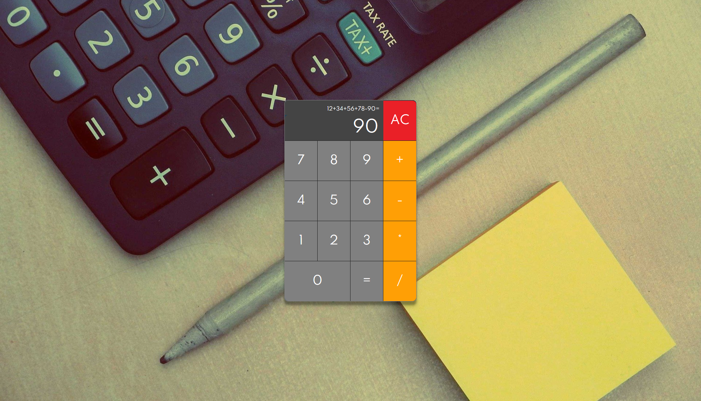

# Calculator-Clone

## 🔗 Demo
https://githubgw.github.io/js-calculator

## 🖥 Preview

## 🔥 Stack
### Front-end
  

## ⚙ Features
- [x] Addition
- [x] Subtraction
- [x] Multiplication
- [x] Division
- [x] All Clear
- [x] Equal
